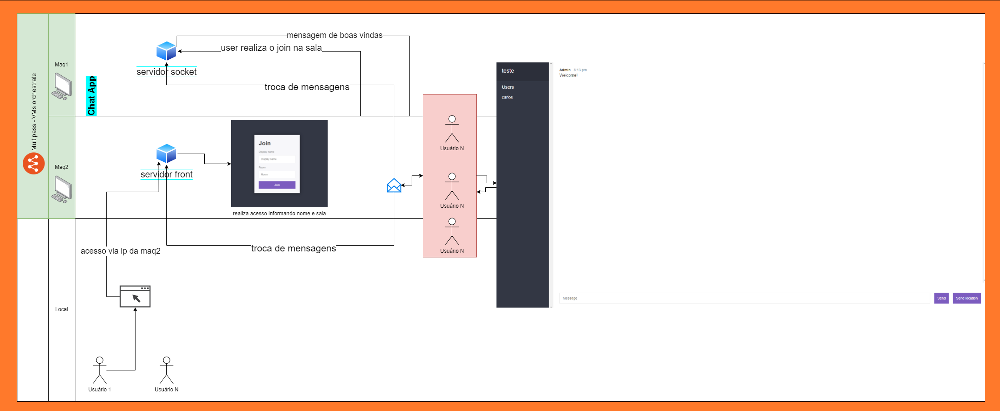
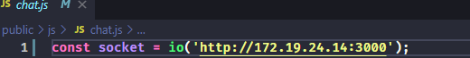
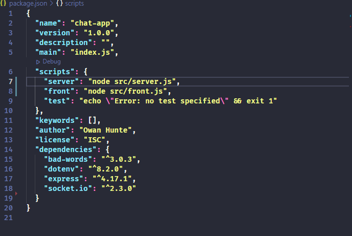

# Node.js Chat App - Distribuidos | TP 01

>  Carlos Henrique Pereira Abreu
>
> Matrícula: 17.2.8226

## Projeto

Esse aplicativo é uma ramificação de um projeto feito em [Node.js](https://nodejs.org/en/download/) que utiliza do múdulo [Express.js](https://expressjs.com/) e da biblioteca de comunicação [Socket.io](https://socket.io/). O projeto Original se encontra no repositório [Node.js Chat App](https://github.com/owanhunte/nodejs-chat-app)

- O projeto modificado se encontra no repositório seguinte:

[Node.js Chat App Distribuidos](https://github.com/carloshnpa/nodejs-chat-app)




## Construção do ambiente virtual

- Para o gerenciamento das VM's foi utulizado o gerenciador [Ubuntu Multipass](https://multipass.run/). O orquestrador é uma abstração para instanciamento de VM's Ubuntu dentro do SO Windows e pode utilizar tanto o Hyper-V quanto o VirtualBox para realizar as virtualizações.

- Para a implementação do projeto foram utilizadas duas máquinas virtuais Ubuntu na sua versão 20.04 LTS, ambas as máquinas foram montadas com 10GB de armazenamento e 2Gb de memória atraés do comando:
```sh
multipass launch -n <nome_da_maquina> -c2 -m 2gb -d 10gb
```  

- As máquinas receberam o nome de **maq1** e **maq2** para facilicar a identificação.


## Instalação de pacotes nas máquinas

- Para acessar a linha de comandos da máquina o acesso pode ser feito pelo PowerShell, utilizando de um comando do Multipass:
```sh
multipass shell <nome_da_maquina>
```

- Como o projeto utiliza do Node para rodar, o primeiro passo é instalar nas máquinas os PAcotes do motor [Node.js](https://nodejs.org/) e seu gerenciador de pacotes [NPM](https://www.npmjs.com/)


```bash
ubuntu@maq1: $ sudo apt update # atuliazação dos pacotes ubuntu
```
```bash
ubuntu@maq1: $ sudo apt install nodejs # instalação no node.js
```
```bash
ubuntu@maq1: $ sudo apt install npm # instalação no NPM
```

>  **A instalação deve ser feita em ambas as máquinas**


## Instalação das dependências do projeto

- Para que a máquina tenha acesso ao disco de armazenamento interno da sua máquina local, deve-se fazer um alias para o mapeamento desse diretório, a plataforma do Multipass oferece um comando que pode ser utilizado para este fim:

```bash
multipass mount C:\ maq1
```
```bash
multipass mount C:\ maq2
```

- O comando acima garante que as máquinas maq1 e maq21 tenham acesso à pasta raiz do Disco C:/ local

- Para fins de praticidade o projeto foi clonado na pasta C:/node-chat-app

No ambiente virtualizado das suas máquinas acesse a pasta do projeto como comando cd

```bash
ubuntu@maq1: $ cd C\:/nodejs-chat-app/
```
```bash
ubuntu@maq1: $ npm install
```

> A instalação dos pacotes nesse caso deve ser feita em apenas uma das máquinas, já que ambas utilizarão dos mesmos pacotes localizados na pasta node_modules do projeto <**Como os ambientes são iguais, não haverá implicações**>


## Modificações do projeto

-  O projeto original continha o mesmo ambiente de Front e Back-Server, rodando na mesma porta e mesma máquina, o que garantia que a comunicação fosse feita de forma facilitada. Para o projeto a inicialização desses dois ambientes foi separado, um sendo inicializado pelo arquivo [front.js](src/front.js) e outro pelo arquivo [server.js](src/server.js).

- As portas dos projetos também foi alterada, juntamente a fonte de conexão do socket.io pelo front, onde deve-se usar o IP da máquina virtual em que o server roda. Alterar no arquivo [aqui](public/js/chat.js) linha 1

  


## Rodando o projeto

- Entrar no bash das máquinas e navegar até o diretório do projeto

```bash
ubuntu@maq1: $ cd C\:/nodejs-chat-app/
```

- Na maq1 iniciar o script do server por meio do npm
```bash
ubuntu@maq1: $ npm run server
```

- Na maq2 iniciar o script do front por meio do npm
```bash
ubuntu@maq1: $ npm run front
```




- Quando o projeto do front e do server forem iniciados, no seu navegador da máquina local, acessar o ip da maq2 (que roda o front) na porta 5000

